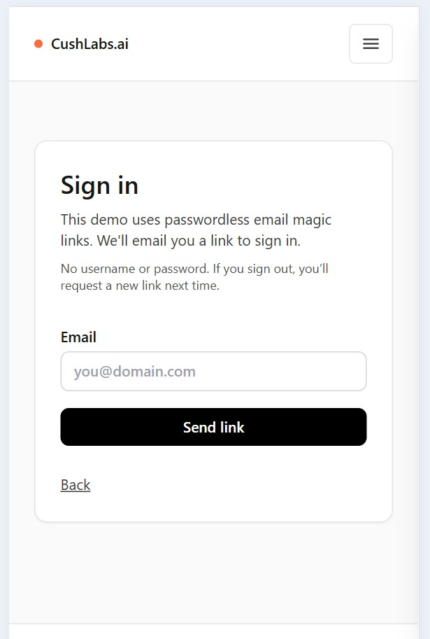

# Next.js Supabase Auth Starter (CushLabs.ai)

A minimal, production-minded Next.js App Router starter focused on **Supabase Auth**, **SSR session refresh**, and an **RLS-first database posture**.

Built as a clean, modern demo you can fork for MVPs.

## Live Demo

- **App**: https://nextjs-supabase-auth-starter.vercel.app
- **About**: https://nextjs-supabase-auth-starter.vercel.app/about
- **Why Magic Links**: https://nextjs-supabase-auth-starter.vercel.app/why-use-magic-links

## Screenshots

### Sign In Page



## Why this starter

- **Secure by default**
  - RLS-first database posture (no “turn off RLS to make it work” shortcuts)
- **SSR-ready auth**
  - Middleware-based session refresh via `@supabase/ssr`
- **Realistic gating patterns**
  - Protected routes (`/app`) and optional admin boundary (`/admin`)
- **Demo-friendly UX**
  - Bilingual UI (EN/ES) with cookie persistence
  - Simple, responsive public layout (mobile hamburger nav)

## Features

- Next.js 14 App Router + TypeScript (strict)
- **Passwordless Authentication**: Supabase Auth with email magic links (no passwords to manage)
- SSR-friendly session refresh in `middleware.ts` via `@supabase/ssr`
- Protected routes example (`/app`)
- Optional admin boundary example (`/admin`) gated by `profiles.role`
- **Bilingual Support**: Full i18n implementation (English/Spanish) with cookie persistence
- RLS-first migrations included:
  - `profiles` table + role enum + trigger + RLS policies
  - `notes` table with strict per-user RLS policies (RLS proof playground)
- Environment variable validation (Zod)
- Minimal CI: `typecheck`, `lint`, `build`

## What This Repo Is

This repo IS:

- A minimal, production-minded auth + RLS starter
- A good base to clone for MVPs where you want real auth and real DB security

## What This Repo Is Not

- A shadcn/ui starter or design system template
- A full SaaS product (billing, teams, subscriptions, multi-tenant RBAC)
- A UI kit / component library
- A CMS/blog starter
- A general-purpose Next.js boilerplate

## BYO Supabase (How Templates Work)

This is a template repo.

- You bring your own Supabase project (hosted or local).
- This repo provides the schema + RLS via SQL migrations.

Without a Supabase project + env vars, the public landing page will render, but auth and protected routes will not be functional.

## Demo walkthrough (what to try)

- **1) Sign in**
  - Go to `/sign-in` and request a magic link
- **2) Prove SSR session refresh**
  - Visit `/app` (protected)
  - Refresh the page; you should remain signed in (middleware refresh)
- **3) Prove RLS per-user isolation**
  - Create notes under your account
  - Sign in as a different user; you should not see the other user’s notes
- **4) Optional: admin gating**
  - Promote a user to `admin` in `profiles`
  - Visit `/admin`

## Quickstart

### 1) Install dependencies

```bash
npm install
```

### 2) Configure env

Copy `.env.example` to `.env.local` and fill in values:

PowerShell:

```powershell
Copy-Item .env.example .env.local
```

macOS/Linux:

```bash
cp .env.example .env.local
```

Required:

- `NEXT_PUBLIC_SUPABASE_URL`
- `NEXT_PUBLIC_SUPABASE_PUBLISHABLE_KEY` (preferred, `sb_publishable_...`)

Legacy (still supported):

- `NEXT_PUBLIC_SUPABASE_ANON_KEY` (legacy `anon` JWT key)

Optional:

- `NEXT_PUBLIC_APP_URL` (useful as a fallback for auth redirect URL; set it to `http://localhost:3000` in dev)

### 3) Apply the database migration (RLS included)

Run:

- `supabase/migrations/20251214190000_init.sql`
- `supabase/migrations/20251216010600_notes.sql`

Apply it via:

- Supabase Dashboard SQL editor, or
- Supabase CLI migrations

What it does:

- Creates `public.app_role` enum (`user`, `admin`)
- Creates `public.profiles` (1:1 with `auth.users`)
- Enables RLS on `public.profiles`
- Adds policies for users to read/update their own profile (admins can read/update all)
- Adds a trigger to create `profiles` rows on new user signup
- Creates `public.notes` (demo table)
- Enables strict per-user RLS policies on `public.notes` (RLS proof playground)

Promote a user to admin (in SQL editor):

```sql
update public.profiles
set role = 'admin'
where id = '<user-uuid>';
```

### 4) Run the app

```bash
npm run dev
```

## Deploying a public demo (Supabase Hosted + Vercel)

If you want a public demo that supports real sign-in, you need:

- A hosted Supabase project
- A hosted Next.js deployment (Vercel recommended)

### 1) Create a Supabase project

- Create a project in Supabase
- Copy your project URL and publishable key

### 2) Apply migrations

Run these in order (Supabase Dashboard SQL editor is fine):

- `supabase/migrations/20251214190000_init.sql`
- `supabase/migrations/20251216010600_notes.sql`

### 3) Configure Supabase Auth redirect URLs

Add these redirect URLs in Supabase Auth settings:

- `http://localhost:3000/auth/callback`
- `http://localhost:3001/auth/callback` (optional if you use 3001 locally)
- `https://YOUR_DEPLOY_DOMAIN/auth/callback`

### 4) Deploy to Vercel

- Import the repo into Vercel (GitHub)
- Set these environment variables:
  - `NEXT_PUBLIC_SUPABASE_URL`
  - `NEXT_PUBLIC_SUPABASE_PUBLISHABLE_KEY`
  - `NEXT_PUBLIC_APP_URL=https://YOUR_DEPLOY_DOMAIN`

### 5) Promote an admin user (optional)

```sql
update public.profiles
set role = 'admin'
where id = '<user-uuid>';
```

## Routes

- `/` - Public landing page
- `/about` - About page with features and benefits
- `/why-use-magic-links` - Detailed explanation of passwordless authentication
- `/sign-in` - Sign-in page (email magic link)
- `/app` - Protected route (auth required)
- `/admin` - Admin-only route (requires `profiles.role = 'admin'`)
- `/lang?lang=<en|es>&next=<path>` - Language switcher

## Security Notes (Read This)

- **RLS is enabled** on `public.profiles` by default.
- **Do not disable RLS** to “make things work”. Fix policies instead.
- This starter does not require a service role key.
  - If you add one later, **never expose it to the browser**.

## Project Structure

```text
.
├─ app/
│  ├─ (marketing)/page.tsx
│  ├─ (auth)/sign-in/
│  ├─ (auth)/auth/callback/
│  ├─ (auth)/auth/sign-out/
│  ├─ app/ (protected)
│  └─ admin/ (admin-only)
├─ lib/
│  ├─ env.ts
│  ├─ auth/
│  └─ supabase/
├─ supabase/
│  ├─ migrations/
│  └─ config.toml
├─ middleware.ts
└─ .github/workflows/ci.yml
```

## Scripts

- `npm run dev`
- `npm run typecheck`
- `npm run lint`
- `npm run build`
- `npm run start`

## License

See `LICENSE`.
